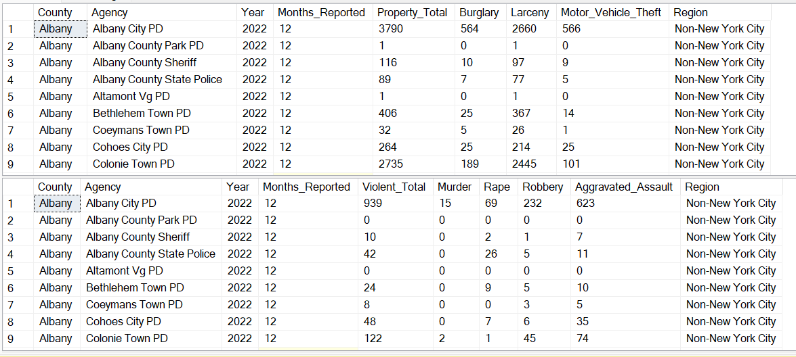
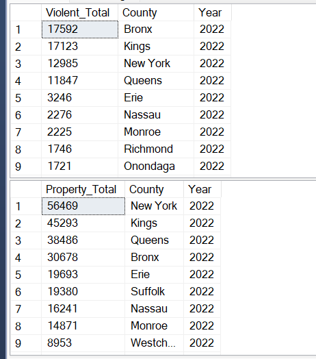
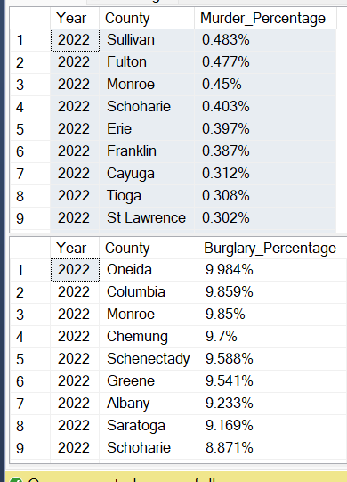
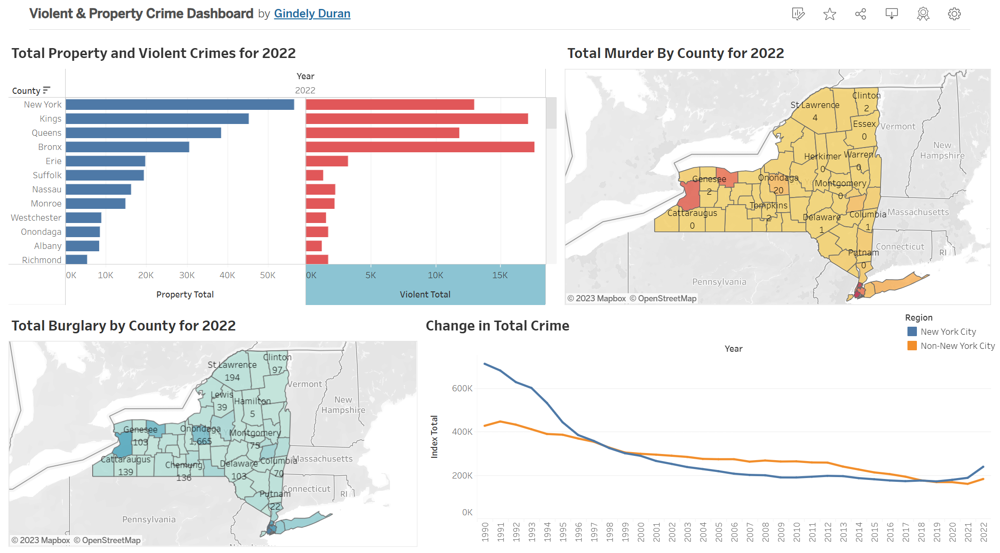

# SQL NYS Crime Analysis and Tableau Dashboard

## Table of Contents
* [Introduction](#Intoduction)
	- [Data Source](#Data-Source)
	- [Variables](#Variables)
* [Technologies](#Technologies)
* [Analysis](#Analysis)
	- [Total of Violent and Property Crime](#Total-of-Violent-and-Property-Crime) 
	- [Murder and Burglary Percentage](#Murder-and-Burglary-Percentage)
* [Tableau Dashboard](#Tableau-Dashboard)

## Introduction
An analysis of violent and property crime that occurred from 1990-2022 in the state of NY. Two datasets were included in the analysis. The first dataset includes all violent crime reported from 1990-2022 and the second dataset includes all property crime reported from 1990-2022.
### Data Source
Data for violent and property Crimes reported to the police from 1990-2022
Index Crimes by County and Agency: Beginning 1990 | State of New York (ny.gov)
### Variables
There are a total of 22,044 observations in both datasets. 
County: Location where crime was reported
Agency: Police Department that reported the crime
Months Reported: Number of months an agency reported for the year
Region: Region where crime was reported, separated by NYC and Non-NYC
Violent Total: The sum of all violent crime; Murder, Rape, Robbery, Aggravated Assault
Murder: The willful killing of one human being to another
Rape: Penetration without the consent of the victim
Aggravated Assault: The unlawful attack by one person upon another for the purpose of inflicting severe or bodily injury. 
Property Total: The sum of all property crime; Robbery, Burglary, Larceny, Motor Vehicle Theft
Robbery: The taking or attempting to take anything of value from a person by force, threat of force, violence, and/or fear
Burglary: The unlawful entry of a structure to commit felony or theft
Larceny: The unlawful taking of property from the possession of another
Motor Vehicle Theft: The theft or attempted theft of a motor vehicle, including automobiles, trucks, buses, motorcycles, and snowmobiles 

## Technologies
SQL

Tableau

## Analysis
### Total of Violent and Property Crime

As expected, the New York City counties of Bronx, Kings, New York, and Queens lead in both violent and property crimes as they are by far the most populated counties in New York. Erie follows in both violent and property crime, followed by Long Island counties of Nassau and Suffolk for property crime and only Nassau County for violent crime in 2022.

### Murder and Burglary Percentage

Next, I further explored out of all crimes committed what counties had the highest percentage of murder and burglary in 2022. Sullivan County had the highest murder percentage while Oneida County had the highest Burglary percentage. Monroe County was in the top 3 counties for both percentages.

## Tableau Dashboard

A link to the interactive dashboard is provided below along with a screenshot for a quick view.
Violent & Property Crime Dashboard | Tableau Public

